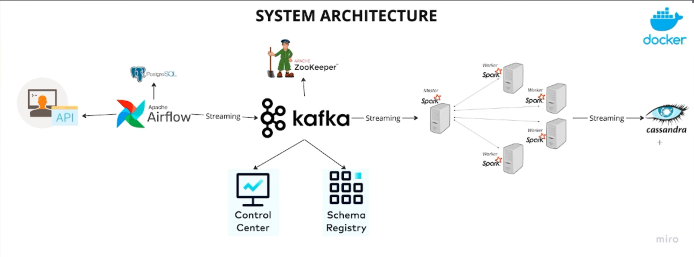

# Data Engineering Pipeline

This repository demonstrates a data engineering pipeline using **Apache Kafka**, **Apache Spark**, **Cassandra**, and **Apache Airflow**. It orchestrates data ingestion, processing, and storage using Docker Compose and various Apache technologies.

### Prerequisites

- Docker & Docker Compose installed on your local machine.
- Ensure Docker is running.
# Architecture Diagram



### Setup Instructions

#### Step 1: Start the Docker Compose Services

To start all services (Kafka, Zookeeper, Airflow, Spark, Cassandra) in detached mode, run:

```bash
docker-compose up -d
```

This will launch the services in the background.

#### Step 2: Access Airflow Web UI

After starting the services, you can access the **Airflow Web UI** at:

[http://localhost:8080/home](http://localhost:8080/home)

Log in with the following credentials:
- **Username**: admin
- **Password**: admin

You can trigger the DAG (`kafka_stream`) from the Airflow UI to start the data pipeline process.

#### Step 3: Running the Spark Script

To manually trigger the Spark job for consuming data from Kafka and writing it to Cassandra, run the following command in your terminal:

```bash
docker exec -it data-eng-pipeline-spark-master-1 spark-submit --master spark://172.18.0.6:7077 --packages org.apache.spark:spark-sql-kafka-0-10_2.12:3.5.3,com.datastax.spark:spark-cassandra-connector_2.12:3.3.0 /opt/bitnami/spark/spark_stream.py
```

This command will submit the Spark job to process the data from Kafka and insert it into Cassandra.

#### Step 4: Querying Data in Cassandra

To query the data stored in Cassandra, use the following command to enter the Cassandra shell (`cqlsh`):

```bash
docker exec -it cassandra cqlsh -u cassandra -p cassandra localhost 9042
```

Once inside the `cqlsh` shell, you can run the following queries:

- **View all data in `created_users` table**:
  ```sql
  SELECT * FROM spark_streams.created_users;
  ```

- **Enable pagination (if data is large)**:
  ```sql
  PAGING ON;
  PAGING 50;
  ```

- **View specific columns (e.g., `id`, `first_name`, `last_name`, `email`)**:
  ```sql
  SELECT id, first_name, last_name, email FROM spark_streams.created_users;
  ```

- **Export data to CSV**:
  ```sql
  COPY spark_streams.created_users TO 'created_users.csv' WITH HEADER = TRUE;
  ```

#### Step 5: Copy the CSV File from Cassandra

To copy the exported CSV file from the Cassandra container to your local machine, run:

```bash
docker cp cassandra:/created_users.csv C:\Users\user\Documents\data-eng-pipeline\created_users.csv
```

Make sure to replace the path with the location where you want to store the CSV file on your machine.

---

### Data Flow Overview

1. **Airflow** orchestrates the entire pipeline, triggering the DAG that pulls data from an API and streams it to Kafka.
2. **Kafka** acts as a message broker, receiving user data from the Airflow DAG and sending it to Spark for processing.
3. **Spark** consumes data from Kafka, processes it, and writes the results to **Cassandra**.
4. **Cassandra** stores the processed data in the `spark_streams` keyspace under the `created_users` table.

---

### Notes

- **Kafka** and **Zookeeper** must be up and healthy for the pipeline to work.
- **Cassandra** should have enough disk space to handle the processed data.
- Make sure the **Spark** connectors (`spark-sql-kafka` and `spark-cassandra-connector`) are correctly installed when running the Spark job.
- You can monitor the **Airflow Web UI** to see the status of the DAG and individual tasks.
- This pipeline will stream data for 1 minute from the API and process it continuously.

---

### Troubleshooting

1. **Airflow DAG not triggering**:
   - Check the Airflow logs for any errors or task failures.
   - Ensure that all services (Airflow, Kafka, Cassandra) are running.

2. **Spark job not starting**:
   - Ensure that Spark is correctly connected to the Kafka and Cassandra services.
   - Verify that the Spark containers can access each other through the Docker network.

3. **Cassandra query issues**:
   - Ensure Cassandra is up and the keyspace and tables have been created.
   - Use `cqlsh` to debug and ensure that the data is being inserted correctly into Cassandra.

---

### Conclusion

This setup demonstrates a fully functional data engineering pipeline using Kafka, Spark, Cassandra, and Airflow. You can monitor, trigger, and manage the pipeline through the Airflow web interface, while using Spark for processing and Cassandra for data storage.

---

### Contributors

- **MEROUANE BENELABDY**
- **MAHMOUD BOUJIR**

---

### License

Ce projet est sous la licence MIT. Voir le fichier LICENSE pour plus d'informations.

---